

# Anvil Extras

A library of utilities and components for use in developing an [Anvil](https://anvil.works) application.

See our **[Full documentation](https://anvil-extras.readthedocs.io/en/latest/)**

## Installation

Add the library as a third party dependency to your app with the token `C6ZZPAPN4YYF5NVJ`.
Full instructions can be found in the [Docs](https://anvil-extras.readthedocs.io/en/latest/guides/installation.html)

## Features

#### Components

| | | | |
|-|:----:|-|:----:|
| Message Pill | 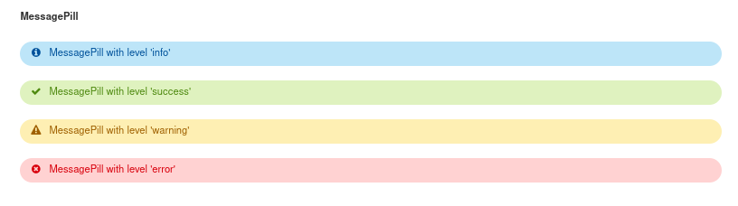 | Progress Bars | 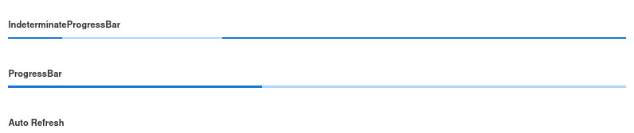 |
| Auto Refreshing |  | Tabs | 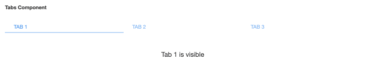 | Switch | 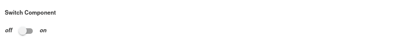 |
| Multi Select Dropdown | 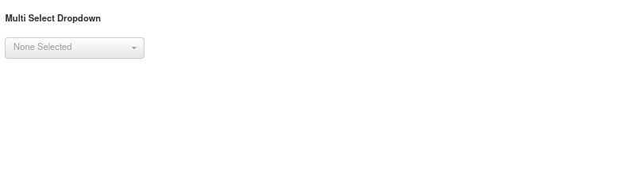 | Quill Editor | 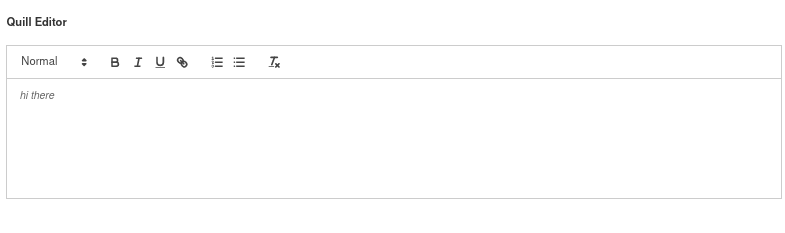 |
| Sliders | 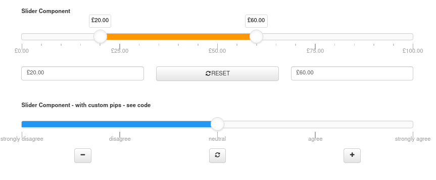 | Chips | 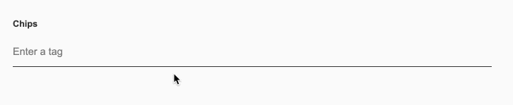 |
| Autocomplete | 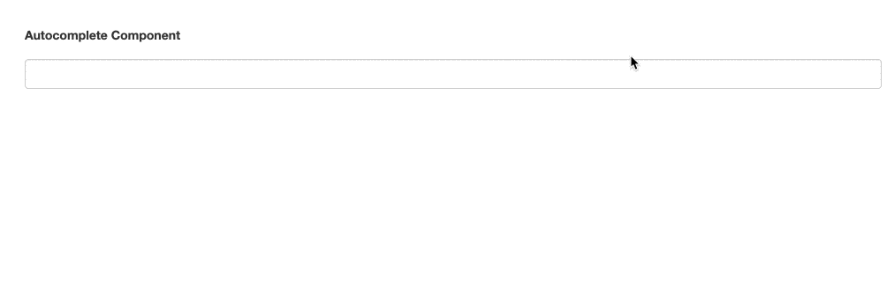 | Pivot | 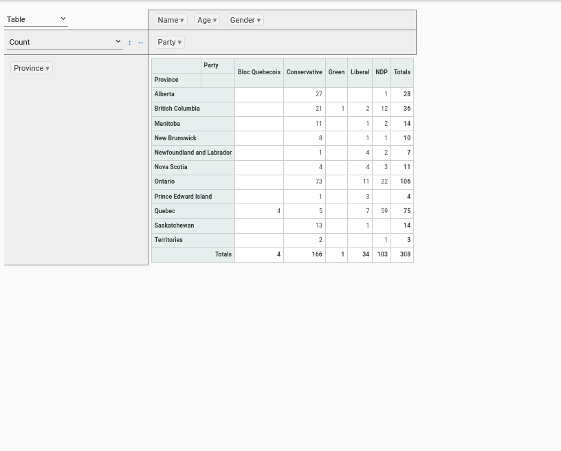 |
| Switch |  ||

 

#### Modules

| | | | |
|-|:----:|-|:----:|
| [Animation](https://anvil-extras.readthedocs.io/en/latest/guides/modules/animation.html) | 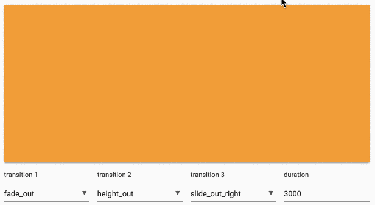 |  |  |

- [Publish/Subscribe Messaging](https://anvil-extras.readthedocs.io/en/latest/guides/modules/messaging.html)
- [Dynamic Menu Construction](https://anvil-extras.readthedocs.io/en/latest/guides/modules/navigation.html)
- [Role Based Authorisation](https://anvil-extras.readthedocs.io/en/latest/guides/modules/authorisation.html)
- [Augmented Events](https://anvil-extras.readthedocs.io/en/latest/guides/modules/augmentation.html)
- [Popovers ](https://anvil-extras.readthedocs.io/en/latest/guides/modules/popover.html)
- [Client and server side logging/timing ](https://anvil_extras.readthedocs.io/en/latest/guides/modules/utils.html)
- [Dynamic serialisation of data table rows](https://anvil-extras.readthedocs.io/en/latest/guides/modules/serialisation.html)

## Contributing

All contributions are welcome!

Please read our [Contribution guide](https://anvil-extras.readthedocs.io/en/latest/guides/contributing.html) before starting any work.

## Maintainers

The maintainers of the project are:

- [Owen Campbell](https://github.com/meatballs)
- [Stu Cork](https://github.com/s-cork)

Both [Owen](https://anvil.works/forum/u/owen.campbell) and [Stu](https://anvil.works/forum/u/stucork) can also be found via the [Anvil Users Forum](https://anvil.works/forum).

## Credits

Most of the effort to produce and maintain this library has come from the personal time
of the contributors without any form of remuneration.

However, some of the effort has been funded by the employers and/or paying clients of
the contributors:

- [Anvil](https://anvil.works)
- [Osmosis Investment Management](https://osmosisim.com)
- [Baker Tilly](https://www.bakertilly.com/)
