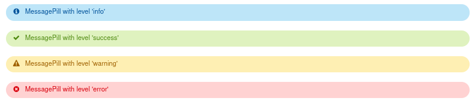

# Anvil Extras

A library of utilities and components for use in developing an [Anvil](https://anvil.works) application.

See our **[Full documentation](https://anvil-extras.readthedocs.io/en/latest/)**

## Installation

Add the library as a third party dependency to your app with the token `C6ZZPAPN4YYF5NVJ`.
Full instructions can be found in the [Docs](https://anvil-extras.readthedocs.io/en/latest/guides/installation.html)

## Features

  
Componenents

| | |
|-|----|
| Pill Message |  |
| Progress Bars |  |
| Auto Refreshing |  |
| Tabs |  |
| Switch |  |
| Multi Select Dropdown |  |
| Quill Editor |  |
| Sliders |  |
| Chips |  |
| Autocomplete |  |

 

**Modules**

- [Publish/Subscribe Messaging](https://anvil-extras.readthedocs.io/en/latest/guides/modules/messaging.html)
- [Dynamic Menu Construction](https://anvil-extras.readthedocs.io/en/latest/guides/modules/navigation.html)
- [Role Based Authorisation](https://anvil-extras.readthedocs.io/en/latest/guides/modules/authorisation.html)
- [Augmented Events](https://anvil-extras.readthedocs.io/en/latest/guides/modules/augmentation.html)
- [Popovers ](https://anvil-extras.readthedocs.io/en/latest/guides/modules/popover.html)
- [Client and server side logging/timing ](https://anvil_extras.readthedocs.io/en/latest/guides/modules/utils.html)

## Contributing

All contributions are welcome!

Please read our [Contribution guide](https://anvil-extras.readthedocs.io/en/latest/guides/contributing.html) before starting any work.

## Maintainers

The maintainers of the project are:

- [Owen Campbell](https://github.com/meatballs)
- [Stu Cork](https://github.com/s-cork)
